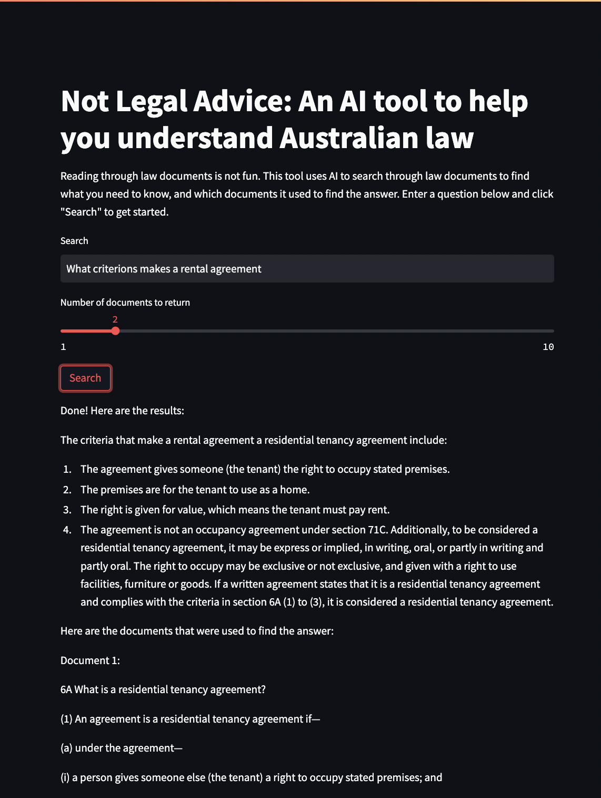

# not-legal-advice
A tool leveraging vector databases and generative large language model to make answering legal questions easier to understand.



## Develop Your Own

## Quick Start

After cloning the repo, do the following to get started!

1. Create a conda environment from the yml file

2. Make a copy of the example environment variables file

   ```bash
   $ cp .env.example .env
   ```

3. Add your [API key](https://beta.openai.com/account/api-keys) and [Pinecone Key and Environment](https://app.pinecone.io/) to the newly created `.env` file

4. Run the app

   ```bash
   $ streamlit run app.py
   ```

--------

The project extends the OpenAI API [GPT4 Retrieval Augmentation tutorial](https://github.com/openai/openai-cookbook/blob/main/examples/vector_databases/pinecone/GPT4_Retrieval_Augmentation.ipynb). It uses the [Streamlit](https://docs.streamlit.io/) web framework.
